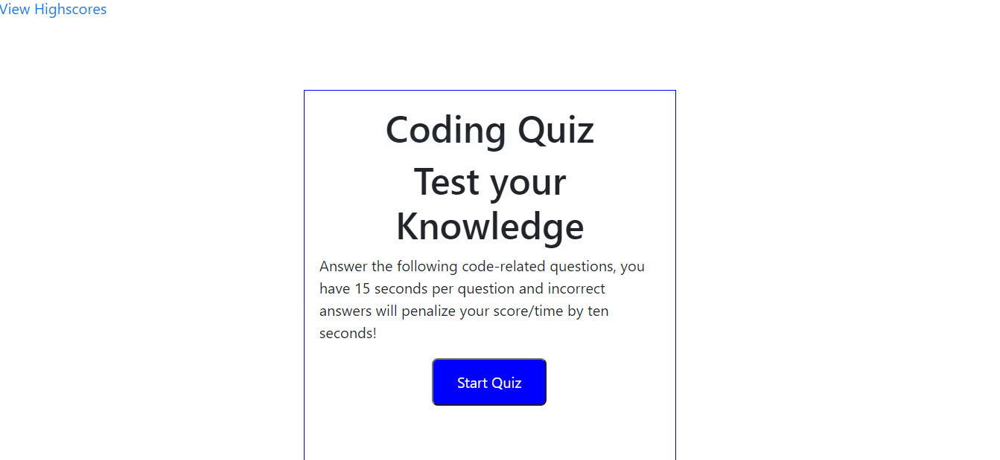
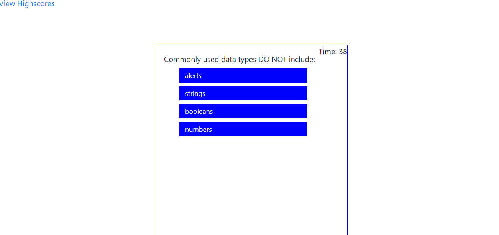
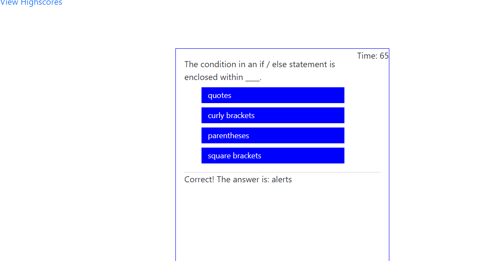
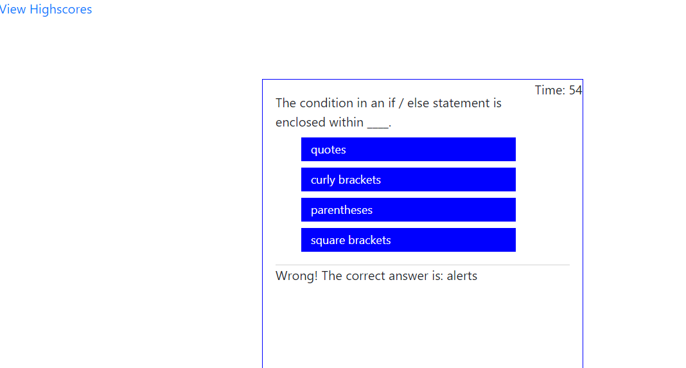
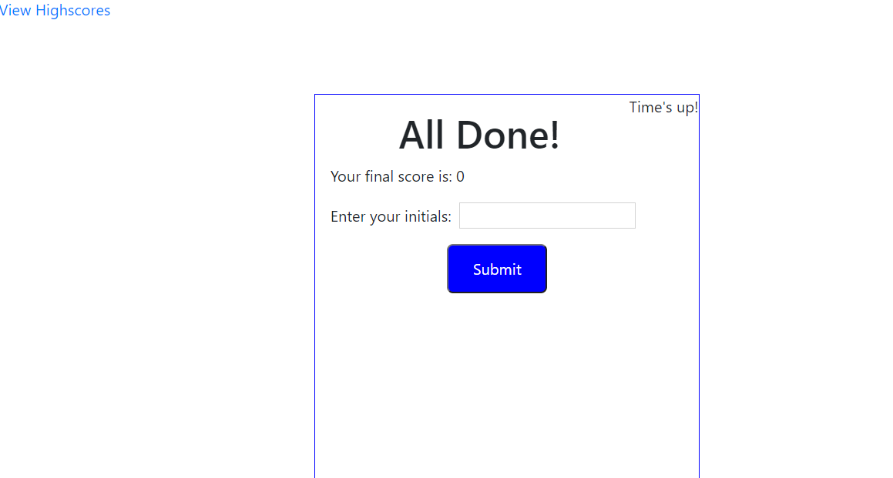
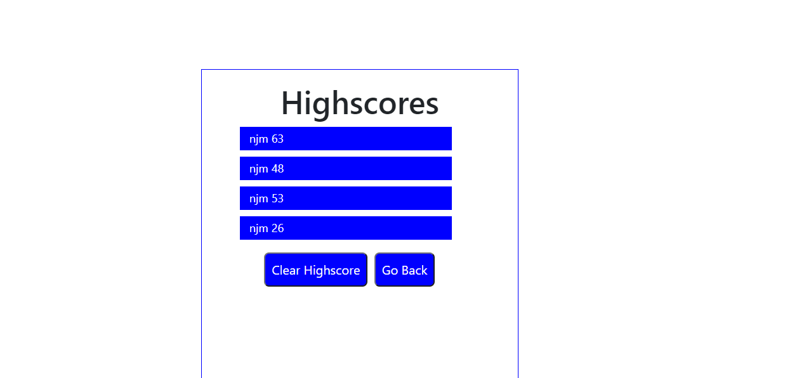

# Code-Quiz---Test-Your-Knowledge

Launch the quiz (https://kcnancy.github.io/Code-Quiz---Test-Your-Knowledge/)

## Table of Contents
* [Description](#description)
* [User Story](#userstory)
* [Development](#development)
* [Usage](#usage)
* [Future Enhancements](#future-enhancements)
* [Credits](#credits)
* [License](#license)

### Description
Quiz of coding terms with the ability to record high scores. 

### User Story
AS A coding boot camp student
I WANT to take a timed quiz on JavaScript fundamentals that stores high scores

SO THAT I can gauge my progress compared to my peers

GIVEN I am taking a code quiz

WHEN I click the start button

THEN a timer starts and I am presented with a question

WHEN I answer a question

THEN I am presented with another question

WHEN I answer a question incorrectly

THEN time is subtracted from the clock

WHEN all questions are answered or the timer reaches 0

THEN the game is over

WHEN the game is over

THEN I can save my initials and score

### Development

This code will start when the user activates the "start quiz' button.
The start box explains that this is a timed quiz with  seconds per question. If a question is answered incorrectly 10 seconds will be subtracted from their score. 
There is a link in the upper left corner to the High Scores page. Scores are recorded with user initials until cleared.

Once the user clicks Start the first of 5 questions appears and the time begins. 

Once the user clicks their answer, the view advances to the next question. Below the answer choices for the new question is the correct or wrong message from the previous question. The timer updates based on the right or wrong answer.

Correct Answer screen shot -

Incorrect Answer screen shot -

This continues until either the timer expires or all 5 questions are answered. The final quiz screen displays 'All Done!' and the final score is diplayed along with a box to enter your initials. Once the Submit button is activated the user is taken to the HighScores page.

The Highscores page shows initials and scores in descending order. Buttons at the bottom of the scores will clear the highscores or Go Back to the Start the quiz screen. 

This code has been verified at multiple screen sizes.

### Usage
HTML, Bootstrap and custom CSS, JavaScript and Snip & Sketch were all used to complete this assignment.

### Potential Future Enhancements
- Multiple question sets.
- Audio response as timer clicks down.
- Audio for correct and incorrect answers.

### Credits
Nancy McBride

### License
MIT License

Copyright (c) 2021 KU Boot Camp

Permission is hereby granted, free of charge, to any person obtaining a copy
of this software and associated documentation files (the "Software"), to deal
in the Software without restriction, including without limitation the rights
to use, copy, modify, merge, publish, distribute, sublicense, and/or sell
copies of the Software, and to permit persons to whom the Software is
furnished to do so, subject to the following conditions:

The above copyright notice and this permission notice shall be included in all
copies or substantial portions of the Software.

THE SOFTWARE IS PROVIDED "AS IS", WITHOUT WARRANTY OF ANY KIND, EXPRESS OR
IMPLIED, INCLUDING BUT NOT LIMITED TO THE WARRANTIES OF MERCHANTABILITY,
FITNESS FOR A PARTICULAR PURPOSE AND NONINFRINGEMENT. IN NO EVENT SHALL THE
AUTHORS OR COPYRIGHT HOLDERS BE LIABLE FOR ANY CLAIM, DAMAGES OR OTHER
LIABILITY, WHETHER IN AN ACTION OF CONTRACT, TORT OR OTHERWISE, ARISING FROM,
OUT OF OR IN CONNECTION WITH THE SOFTWARE OR THE USE OR OTHER DEALINGS IN THE
SOFTWARE.

